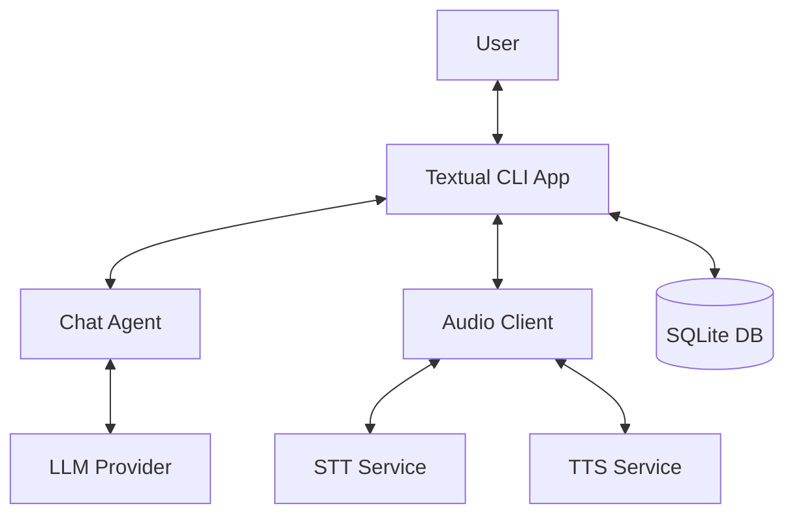
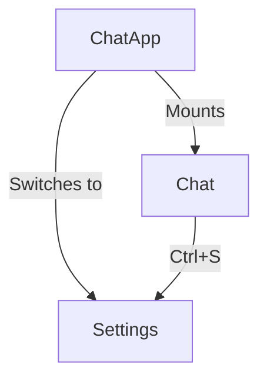
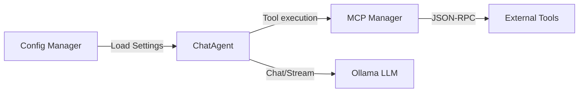
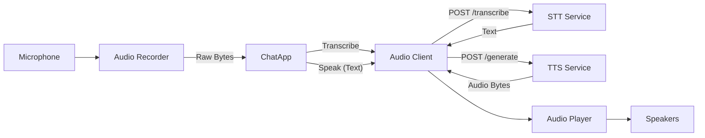
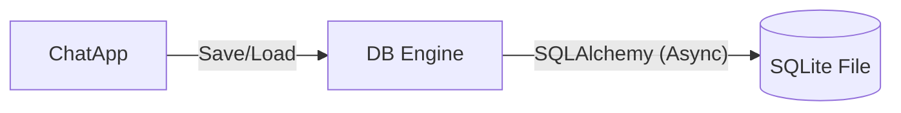

# Architecture

## High-Level Design

The `ai_term` application is designed as a modular, event-driven Terminal User Interface (TUI) that integrates local AI capabilities. It separates concerns between the user interface, core application logic, audio processing, and data persistence.

[View Detailed Architecture Diagram](../img/architecture-detail.svg){ target="_blank" .md-button }

---

## Component Details

### 1. User Interface (UI) Layer
The UI is built using **Textual**, a TUI framework for Python. It follows a screen-based architecture where the `ChatApp` manages navigation between different screens.

*   **ChatScreen**: The main interface for user interaction, handling message display, input, and voice controls.
*   **SettingsScreen**: Configuration management for AI models, audio devices, and themes.
*   **HelpScreen**: Static information and key references.

### 2. Core Logic & Agent
The core logic resides in the `ai_term.cli.core` package. The `ChatAgent` is the brain of the application, orchestrating interactions between the user, the LLM (via Ollama), and external tools (via MCP).

*   **ChatAgent**: initialized with system prompts and capable of function calling.
*   **MCP Manager**: Discovers and connects to Model Context Protocol servers to extend agent capabilities.
*   **Config Manager**: Handles persistent configuration (models, API keys, themes).

::: ai_term.cli.core.agent.ChatAgent
::: ai_term.cli.core.mcp_manager.MCPManager

### 3. Audio Pipeline
The audio system is designed for real-time interaction. It uses a client-server architecture where heavy processing (Speech-to-Text and Text-to-Speech) is offloaded to local Docker containers to ensure the CLI remains responsive.

*   **AudioRecorder**: Captures raw audio from the microphone using `sounddevice`.
*   **AudioClient**: Sends audio data to the STT service and text to the TTS service via HTTP.
*   **AudioPlayer**: Plays back the synthesized audio.

::: ai_term.cli.core.audio_client.AudioClient

### 4. Data Persistence
Application state, chat history, and sessions are persisted in a local SQLite database using **SQLAlchemy** (asyncio).

*   **Session**: Represents a conversation thread.
*   **Message**: Individual user or assistant messages, including tool calls.

