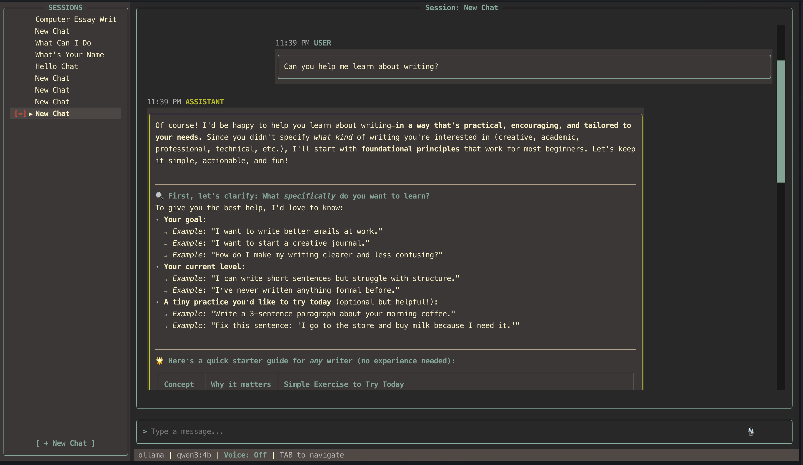

  

# ai_term

**ai_term** is an intelligent, voice-enabled terminal assistant that integrates LLMs, Speech-to-Text (STT), and Text-to-Speech (TTS) into a powerful CLI experience.

## Features

- **🗣️ Voice Interaction**: Talk to your terminal and hear responses back.
- **🧠 LLM Integration**: Support for Local (Ollama) and Cloud (OpenAI, Anthropic) models.
- **🔌 MCP Support**: Model Context Protocol client for extensible tool use.
- **🖥️ TUI Interface**: Beautiful, responsive terminal UI built with Textual.
- **⚙️ Dynamic Configuration**: Easy-to-use settings screen for managing providers and secrets.

## Getting Started

Check out the [Setup Guide](setup.md) to install and configure **ai_term**.

## Architecture

The application is split into three main components:

1. **CLI Client**: The main TUI application.
2. **STT Service**: FastAPI service for voice transcription (Whisper).
3. **TTS Service**: FastAPI service for speech synthesis (Coqui/ElevenLabs).

Explore the [CLI Documentation](cli/index.md) for more details.
